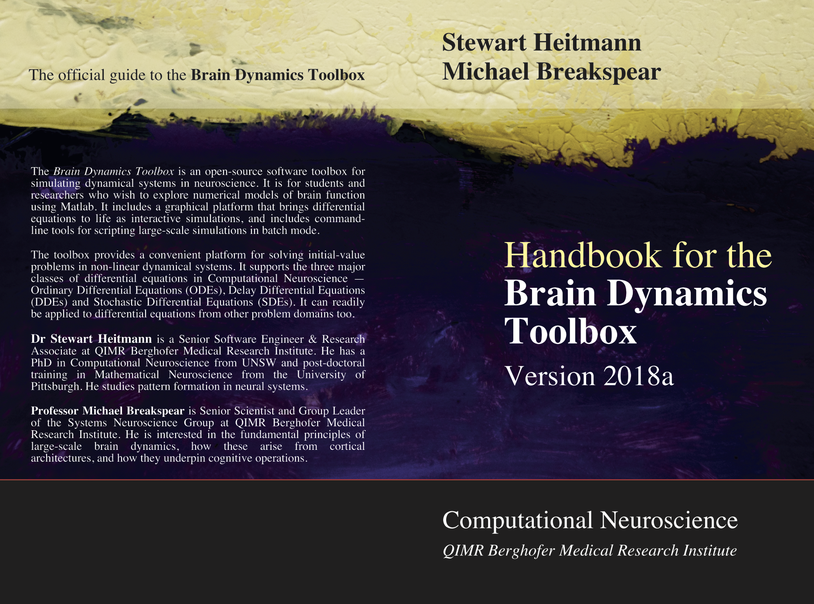

# Brain Dynamics Toolbox

##Version 2018a
Released 20 Mar 2018.

The [Brain Dynamics Toolbox](http://www.bdtoolbox.org) is an open-source software toolbox for simulating dynamical systems in neuroscience. It is for students and researchers who wish to explore numerical models of brain function using Matlab. It includes a graphical platform that brings differential equations to life as interactive simulations, and includes command-line tools for scripting large-scale simulations in batch mode.

## Getting Started
Download the latest official release (Version 2018a) from [http://www.bdtoolbox.org](http://www.bdtoolbox.org). 
Follow the *Getting Started* section of the *Handbook for the Brain Dynamics Toolbox*.

## BSD License
This software is freely available under the [2-clause BSD license](https://opensource.org/licenses/BSD-2-Clause).

Copyright (C) 2016-2018 QIMR Berghofer Medical Research Institute.

Redistribution and use in source and binary forms, with or without modification, are permitted provided that the following conditions are met:

1. Redistributions of source code must retain the above copyright notice, this list of conditions and the following disclaimer.

2. Redistributions in binary form must reproduce the above copyright notice, this list of conditions and the following disclaimer in the documentation and/or other materials provided with the distribution.

THIS SOFTWARE IS PROVIDED BY THE COPYRIGHT HOLDERS AND CONTRIBUTORS "AS IS" AND ANY EXPRESS OR IMPLIED WARRANTIES, INCLUDING, BUT NOT LIMITED TO, THE IMPLIED WARRANTIES OF MERCHANTABILITY AND FITNESS FOR A PARTICULAR PURPOSE ARE DISCLAIMED. IN NO EVENT SHALL THE COPYRIGHT HOLDER OR CONTRIBUTORS BE LIABLE FOR ANY DIRECT, INDIRECT, INCIDENTAL, SPECIAL, EXEMPLARY, OR CONSEQUENTIAL DAMAGES (INCLUDING, BUT NOT LIMITED TO, PROCUREMENT OF SUBSTITUTE GOODS OR SERVICES; LOSS OF USE, DATA, OR PROFITS; OR BUSINESS INTERRUPTION) HOWEVER CAUSED AND ON ANY THEORY OF LIABILITY, WHETHER IN CONTRACT, STRICT LIABILITY, OR TORT (INCLUDING NEGLIGENCE OR OTHERWISE) ARISING IN ANY WAY OUT OF THE USE OF THIS SOFTWARE, EVEN IF ADVISED OF THE POSSIBILITY OF SUCH DAMAGE.

